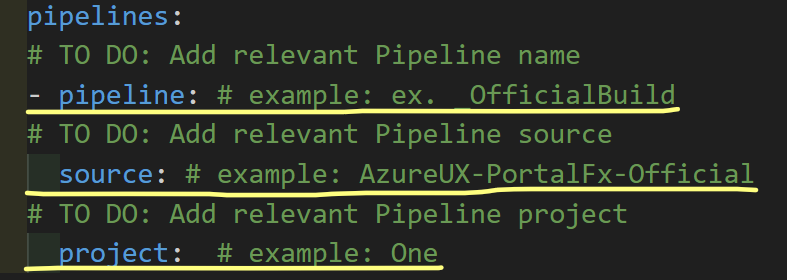
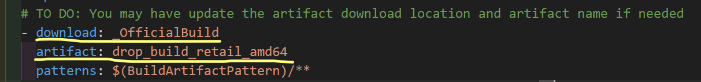
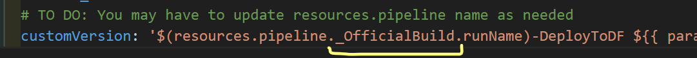
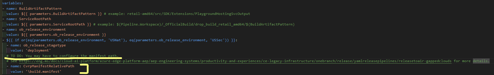
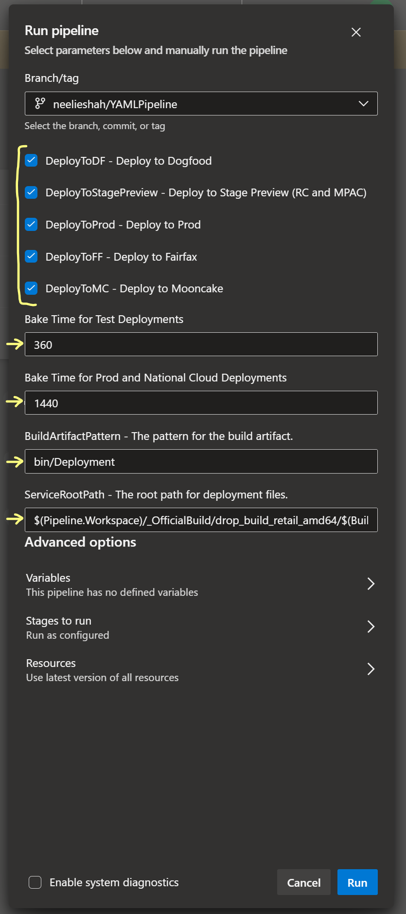

# Template YAML Pipeline for Extensions

These template pipelines deploy your extension via YAML. To learn more about YAML pipelines, visit [here](https://eng.ms/docs/cloud-ai-platform/azure-edge-platform-aep/aep-engineering-systems/productivity-and-experiences/ce-legacy-infrastructure/onebranch/release/yamlreleasepipelines/pipelinebasics).

## Templates offered

The template pipelines currently available are:

- [UnifiedRollout.RpClassicCombined.yml](Deployment/UnifiedRollout.RpClassicCombined.yml)
  - Uses a Unified Rollout Spec
  - Classic Deployment and RP Deployment
  - Can deploy to DF (classic only), RC/MPAC, Prod, Fairfax, and Mooncake environments depending on your configuration.
- [UnifiedRollout.RpOnly.yml](Deployment/UnifiedRollout.RpOnly.yml)
  - Uses a Unified Rollout Spec
  - RP deployment only
  - Can deploy to RC/MPAC, Prod, Fairfax, and Mooncake environments depending on your configuration.
- [RevertToLKG.RpOnly.yml](Deployment/RevertToLKG.RpOnly.yml) ( NOTE: The RevertToLKG pipeline is not yet ready for use. )
  - Reverts to LKG
  - RP deployment only
  - Can revert in RC/MPAC, Prod, Fairfax, and Mooncake environments depending on your configuration.
- [Slots.RpOnly.yml](Deployment/Slots.RpOnly.yml)
  - Deploy Slots
  - RP deployment only
  - Can deploy to RC/MPAC, Prod, Fairfax, and Mooncake environments depending on your configuration.

## How to set up

The templates are made so that minimal set up needs to be done. Aside from a few customizations, they should be ready to use out of the box. Here are the few places where you will need to edit your pipeline before use:

- In any of the offered templates, you will need to supply your pipeline resource name, source, and project.
  - For more information on the pipeline property of your YAML pipeline, visit the docs on the
[resources.pipelines.pipeline definition](https://learn.microsoft.com/en-us/azure/devops/pipelines/yaml-schema/resources-pipelines-pipeline?view=azure-pipelines#properties).
  - To learn more about YAML pipeline schema in general, you can do so [here](https://learn.microsoft.com/en-us/azure/devops/pipelines/yaml-schema/?view=azure-pipelines).

    

- In [Extension.common.deploy.RP.yml](Deployment/Common/Extension.common.deploy.RP.yml) and/or [Extension.common.deploy.yml](Deployment/Common/Extension.common.deploy.yml), you *may* need to update the artifact download location and artifact name depending on the pipeline resource name that you configured above.

  

- Additionally, in [Extension.common.SetPipelineName.yml](Deployment/Common/Extension.common.SetPipelineName.yml), you *may* have to update the resources.pipeline name depending on the pipeline resource name that you configured above.

  

- If you plan to deploy to USNat/USSec, you *may* have to update the CvrpManifestRelativePath and/or ArtifactToDeploy in [Extension.common.deploy.RP.yml](Deployment/Common/Extension.common.deploy.RP.yml) and/or [Extension.common.deploy.yml](Deployment/Common/Extension.common.deploy.yml). More information on this can be found [here](https://eng.ms/docs/cloud-ai-platform/azure-edge-platform-aep/aep-engineering-systems/productivity-and-experiences/ce-legacy-infrastructure/onebranch/release/yamlreleasepipelines/releasetoair-gappedclouds).

  

- Before running your pipeline, you *may* have to edit the parameters on the side to pick what environments to deploy to, what bake time to use, and paths for the build artifact and service root.
  - Currently, the default is to deploy to all environments, to use a 24-hour bake time (classic only), and to use default paths for the build artifact pattern and service root path. If this is not the case, it will have to be edited here.

    
